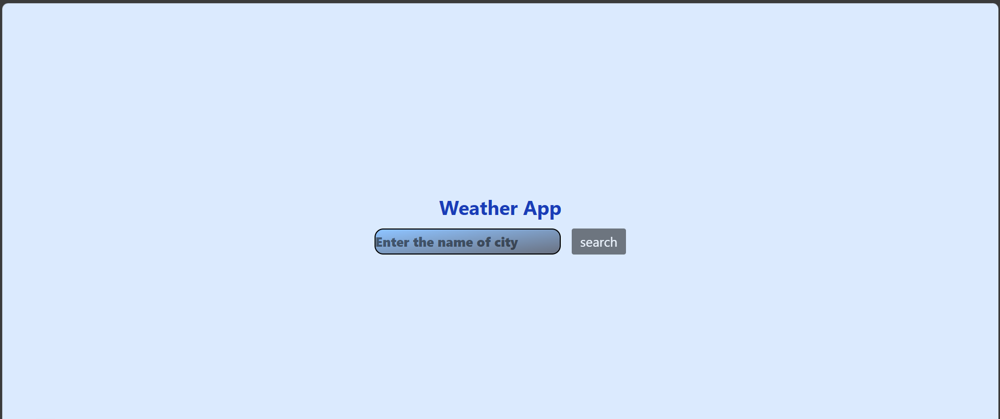
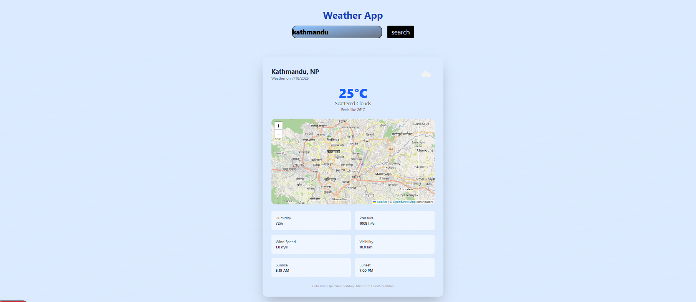

# Weather App with Map

A dynamic weather application built with **Next.js**, **TailwindCSS**, **OpenWeatherMap API**, and **Leaflet.js + OpenStreetMap**.

Users can:

- Search for any city.
- View the current weather, temperature, humidity, wind, sunrise, and sunset times.
- See the location on an interactive map.

---

## Demo


---

## Tech Stack

- [Next.js](https://nextjs.org/) — React framework
- [TailwindCSS](https://tailwindcss.com/) — Styling
- [OpenWeatherMap API](https://openweathermap.org/api) — Weather data
- [React Leaflet](https://react-leaflet.js.org/) — Map integration
- [OpenStreetMap](https://www.openstreetmap.org/) — Map tiles

---

## Features

✅ Search for a city  
✅ View real-time weather conditions  
✅ See an interactive map of the city  
✅ Fully responsive and mobile-friendly  
✅ Smooth UI with TailwindCSS

---

## Screenshots




## Getting Started

First, run the development server:

```bash
npm run dev
# or
yarn dev
# or
pnpm dev
# or
bun dev
```

Open [http://localhost:3000](http://localhost:3000) with your browser to see the result.

You can start editing the page by modifying `app/page.tsx`. The page auto-updates as you edit the file.

This project uses [`next/font`](https://nextjs.org/docs/app/building-your-application/optimizing/fonts) to automatically optimize and load [Geist](https://vercel.com/font), a new font family for Vercel.

## Learn More

To learn more about Next.js, take a look at the following resources:

- [Next.js Documentation](https://nextjs.org/docs) - learn about Next.js features and API.
- [Learn Next.js](https://nextjs.org/learn) - an interactive Next.js tutorial.

You can check out [the Next.js GitHub repository](https://github.com/vercel/next.js) - your feedback and contributions are welcome!
